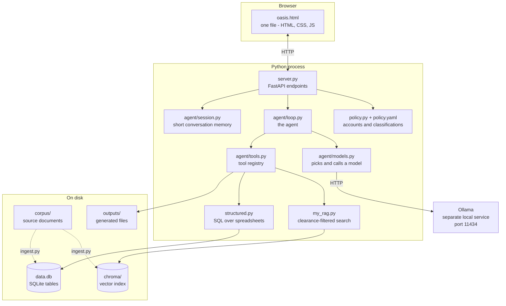
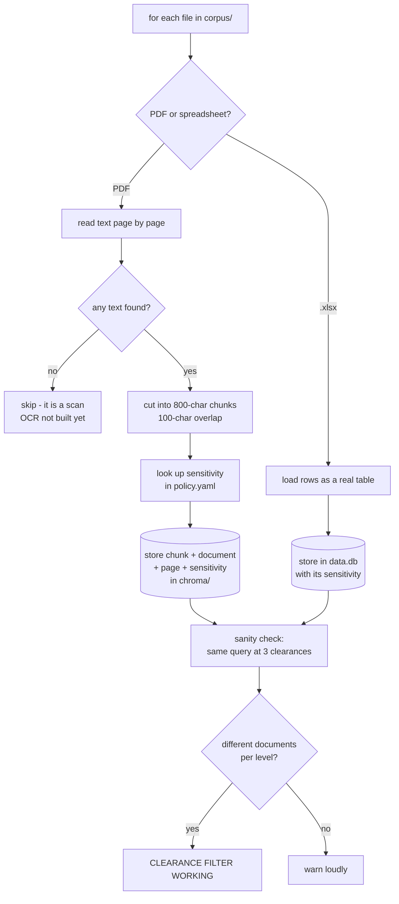
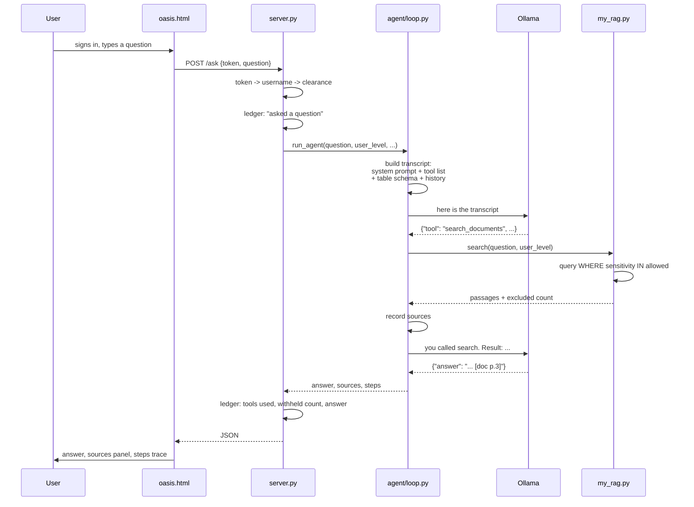
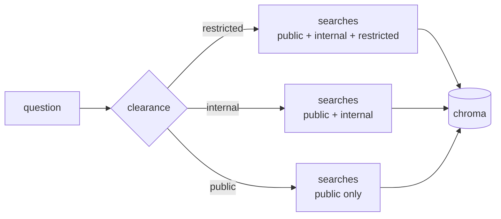
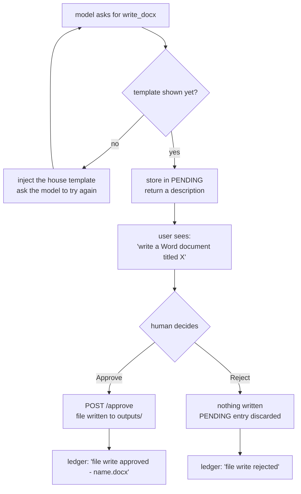

# OASIS — How It Works

For someone who has never seen this codebase. Read top to bottom; each section
assumes the one before it.

Every diagram below is Mermaid, which renders automatically on GitHub.

---

## 1. What the system is

A refinery has thousands of documents. Some are safe for a contractor at the
gate. Some are internal. Some are safety-critical and restricted. Staff need
answers from those documents, but who is asking must change what they are
allowed to see, and no document may leave the site.

OASIS answers questions from those documents, on one machine, with no internet
connection, and filters what it retrieves by the asker's clearance. It cites the
document and page for every claim, and when it produces a file it proposes the
file and waits for a human to approve it.

Three ideas carry the whole design:

**Retrieval, not recall.** The model is not asked what it knows. It is given
passages from the plant's own documents and told to answer only from them.

**Clearance at query time.** The filter is applied inside the database query, so
restricted content is never fetched for a user who lacks clearance. It is not
fetched and then hidden.

**Correctness lives in the tool layer.** Numbers come from SQL over a
spreadsheet or from a calculator, never from the model's head. Files are written
by code, not by the model.

---

## 2. The parts



Nothing in that diagram reaches the internet. Ollama is a separate program on
the same machine; `models.py` talks to it over `localhost`.

---

## 3. Ingestion — loading documents, run once

Before anything can be answered, documents have to be indexed. `ingest.py` does
this. It is a manual step, and forgetting it is the single most common mistake:
the server then starts perfectly and every answer comes back with no sources.



Two things worth understanding.

**Why chunks overlap.** A sentence that straddles a boundary would otherwise be
lost from both pieces. 100 characters of overlap means it survives in one.

**Why spreadsheets go somewhere else.** Asking "how many work orders for P-101"
by semantic similarity over chunked text gives an approximate answer. Loading
the sheet into SQLite as a real table means the question is answered by
`SELECT COUNT(*)`, which is exact. That is a deliberate split, not an
inconsistency.

**The sensitivity label is written into the index at ingest time.** So changing
`policy.yaml` does nothing until you re-ingest. That surprises people.

---

## 4. One question, end to end

This is the path every question takes.



Note the shape: the model is asked **twice**. Once to decide what to do, once to
answer using what came back. That is the agent loop.

---

## 5. The agent loop, in pseudocode

This is `run_agent` in `agent/loop.py`, simplified but faithful.

```
function run_agent(question, user_level, token):

    transcript = SYSTEM_PROMPT
               + list of available tools
               + which SQL tables this clearance may read
               + last few turns of this session
               + "Request from <name>: <question>"

    steps   = []          # what happened, shown to the user
    sources = []          # documents cited, shown to the user

    repeat at most MAX_STEPS (7) times:

        reply = ask_model(transcript, route_on = question)

        move = extract_json(reply)        # strip <think> blocks,
                                          # take the LAST {...} with a
                                          # "tool" or "answer" key

        if move is nothing:
            if reply was empty        and retries left:  ask again, shorter
            if reply was cut-off json and retries left:  ask again, shorter
            otherwise: treat the prose as the final answer, stop

        if move has "answer" and no "tool":
            return that answer                            # DONE

        tool = TOOLS[move.tool]
        if tool does not exist:
            tell the model which tools exist, loop again

        if tool.changes_state:                            # write_docx etc.
            if we have not yet shown the template:
                find the organisation's template for this document type
                add it to the transcript
                say "call the write tool again, shaped to this"
                loop again                                # one extra turn
            else:
                store the call in PENDING
                return a proposal - WRITE NOTHING TO DISK  # DONE
        else:                                             # read-only tool
            force user_level into the arguments           # not model-supplied
            result = tool.fn(args)
            if tool was search_documents:
                add each passage's document+page to sources
            append result to the transcript
            loop again

    return "I could not complete that within the step limit."
```

Five things in there are load-bearing.

**`route_on = question`.** The transcript contains the system prompt, and the
system prompt mentions "calculate", "python" and "sql" in the tool
instructions. Routing on the whole transcript matched those words and sent
every request to the coding model. Routing looks at the user's question only.

**Take the LAST json object.** A reasoning model writes things like
`maybe {"tool": "calculate"}? no` inside its own deliberation. Taking the first
`{...}` runs the call the model rejected.

**`user_level` is forced, not accepted.** The model supplies the question or the
SQL; the clearance comes from the session token. A model cannot escalate its own
privileges because it never supplies them.

**`changes_state` returns instead of running.** That is the approval gate. The
call is stored, described to the user, and executed only when a human approves.

**MAX_STEPS.** Without a cap, a confused model loops forever.

---

## 6. The clearance filter — the line that matters

In `my_rag.py`:

```python
res = col.query(
    query_texts=[question],
    n_results=k,
    where={"sensitivity": {"$in": allowed}},     # <- this line
)
```

`allowed` comes from `policy.py`: a user's own level plus everything below it.
`restricted` → `[public, internal, restricted]`. `public` → `[public]`.



The reason this is inside the query rather than after it: a filter applied
afterwards means the restricted text was loaded into memory, passed through the
program, and possibly logged, before being dropped. Filtering inside the query
means it is never read. Both look identical in a demo. Only one is secure.

---

## 7. The approval gate

Every tool in the registry carries a `changes_state` flag.

| Tool | changes_state | What happens |
|---|---|---|
| `search_documents` | false | runs immediately |
| `calculate` | false | runs immediately |
| `query_data` | false | runs immediately |
| `write_docx` | **true** | proposed, waits for a human |
| `write_pptx` | **true** | proposed, waits for a human |
| `write_xlsx` | **true** | proposed, waits for a human |



The template step costs one extra model call and is worth it: without it the
model invents its own layout; with it the document comes out in the
organisation's format. It happens once per request, in code, so it cannot be
forgotten.

---

## 8. Model selection

`agent/models.py`, function `pick()`. Three lines of plain Python, no model
involved:

```
if images are attached      -> vision model
if the question contains a
   calculation/code keyword -> coding model
otherwise                   -> general model
```

Deterministic, instant, and testable. `agent/tests/eval_routing.py` scores it
against 48 labelled questions and prints its own failures.

It scores about 81%, and the misses do not matter. Model selection decides
**which model writes prose**. It does not decide what runs. "Add up the downtime
for Q1" routes to `general` — a miss — and still calls `calculate`, and still
returns an exact figure, because tool choice is made separately by the model
from the tool catalogue inside the loop.

That is the design claim worth remembering: **routing is an optimisation. A
wrong route is slower, never wrong.**

---

## 9. The audit ledger

Every action appends an entry, and each entry's hash includes the previous
entry's hash. Change any past entry and every hash after it stops matching, so
tampering is detectable.

```
entry 1:  prev = 000000000000   hash = H(1 + actor + event + prev)
entry 2:  prev = <hash of 1>    hash = H(2 + actor + event + prev)
entry 3:  prev = <hash of 2>    ...
```

Logged: sign-in, failed sign-in, file attached, question asked, each tool used,
**documents withheld above clearance**, proposal made, answer given with the
model name, approve or reject, upload outcomes.

The withheld entry is the one an auditor actually wants — in an access-control
system, the denial is the event worth recording.

The ledger is visible to administrators only. It names every actor and every
filename, so showing it to a contractor would leak both other people's activity
and the existence of restricted documents.

Two honest limitations: it is in memory, so it is lost on restart, and the
timestamp has no date.

---

## 10. File by file

| File | What it does | Read it if |
|---|---|---|
| `oasis.html` | Entire frontend — markup, styling, and the fetch calls | changing the interface |
| `server.py` | HTTP endpoints, sessions, the ledger | adding an endpoint |
| `policy.yaml` | Accounts, clearance levels, per-document classification | changing who sees what |
| `policy.py` | Reads that file; `allowed_levels()` lives here | changing the clearance rules |
| `ingest.py` | Builds the index from `corpus/` | documents behave oddly |
| `my_rag.py` | The clearance-filtered search | changing retrieval |
| `structured.py` | Spreadsheets as SQL tables | changing numeric answers |
| `agent/loop.py` | The agent loop, approval gate, JSON extraction | changing agent behaviour |
| `agent/models.py` | Routing, the Ollama call, fallback | changing models |
| `agent/config.py` | The three model names, nothing else | swapping a model |
| `agent/tools.py` | The tool registry | adding a tool |
| `agent/tools_impl/` | One file per tool | changing what a tool does |
| `agent/session.py` | Last 3 turns, per session token | changing follow-up behaviour |

---

## 11. Adding a tool

The whole point of the registry design. Two steps, nothing else changes.

Write `agent/tools_impl/my_tool.py`:

```python
def tool_my_tool(some_arg: str, user_level: str = "public") -> dict:
    """Return a JSON-serialisable dict. Never raise."""
    return {"ok": True, "result": ...}
```

Add one row in `agent/tools.py`:

```python
"my_tool": {
    "fn": tool_my_tool,
    "args": "some_arg",
    "what": "one line the model reads to decide when to use this",
    "changes_state": False,          # True if it writes or changes anything
    "describe": lambda a: f"do the thing with {a['some_arg']}",
},
```

The model now sees it in the catalogue and can choose it. No change to the loop,
the server, or the frontend.

**The rule that cannot be broken:** anything touching documents takes
`user_level` and goes through `my_rag.search`. Never around it.

---

## 12. Running it

```bash
cd oasis
source .venv/bin/activate        # Windows: .venv\Scripts\activate
python3 ingest.py                # once, and after any document change
uvicorn server:app --reload --port 8000
```

Then open `oasis.html`. Ollama must be running separately with the models
pulled (`ollama list`).

Three things that fail quietly rather than loudly:

- **Skipping `ingest.py`** — server starts, every answer has zero sources.
- **Starting uvicorn from the wrong directory** — `my_rag.py` resolves the index
  as `./chroma`, relative to where you launched it.
- **A model not pulled** — the request falls back to the general model, and the
  model badge shows `(fallback)`.

---

## 13. What is not built

Do not demo these. See `TEST_CASES.md` §10.

- Sandboxed code execution
- OCR for scanned documents and drawings
- Chart generation from spreadsheet data
- Sensitivity classification on upload (a human types the level today)
- Real egress counters — the sovereignty panel shows fixed values
- Ledger persistence across restarts
